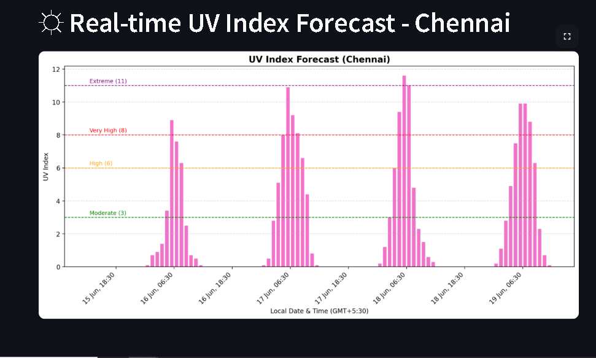

### 🌤️ UV Index Forecast Dashboard
This is a simple Streamlit web application that fetches and visualizes the real-time UV Index forecast for Chennai 
using data from the `currentuvindex.com API`. The app displays the UV forecast in a bar chart format, highlighting 
various risk levels according to the UV index scale.

### 📸 Screenshot


### 📦 Features
- Fetches real-time UV index data from a public API

- Converts UTC timestamps to IST (GMT+5:30)

- Displays a clean and informative bar chart using matplotlib

- Annotates UV index severity levels (Moderate, High, Very High, Extreme)

- Easy-to-deploy Streamlit frontend

### 🚀 How to Run
#### 🛠 Prerequisites
Make sure you have the following installed:
- `Python 3.7+`
- `pip (Python package manager)`

### 📥 Installation
```bash 
# Clone the repo git clone https://github.com/your-username/uv-index-dashboard.git 
# Navigate into the project directory cd uv-index-dashboard 
# Install dependencies pip install -r requirements.txt 
```

### ▶️ Run the App
```bash streamlit run app.py ```

### 🧰 Dependencies
- `requests`
- `matplotlib`
- `streamlit`

### 🌐 API Reference
This app uses the currentuvindex.com API to fetch forecast data:
```https://currentuvindex.com/api/v1/uvi?latitude=13.0843&longitude=80.2705```

Returns a list of forecasts with:

- `time` (in UTC)

- `uvi` (UV index value)

### 📅 Timezone Handling

The app converts all times from UTC to Indian Standard Time (GMT+5:30) using Python's `datetime` module.

### 📊 UV Index Levels
| Level       | Index Range | Color   |
|-------------|-------------|---------|
| Low         | 0–2         | -       |
| Moderate    | 3–5         | Green   |
| High        | 6–7         | Orange  |
| Very High   | 8–10        | Red     |
| Extreme     | 11+         | Purple  |


### ✍️ Author
Developed by `Helicase11`.
Feel free to reach out or contribute!


